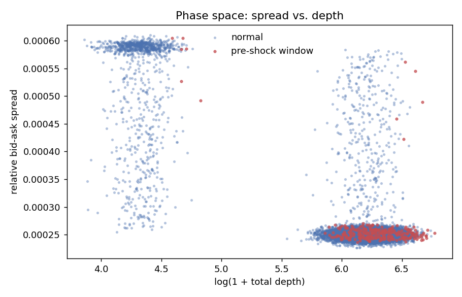

# liquidity-anomaly-detector

[](https://github.com/YOUR_USERNAME/liquidity-anomaly-detector/actions/workflows/ci.yml)
[](https://www.python.org/)
[](LICENSE)

An anomaly-detection and forecasting engine for securities markets that
predicts **liquidity drying up** — impending drops in order-book depth
or spikes in short-horizon volatility — from Level-2 order-book
sequences, rather than attempting to predict price direction.



*Pre-shock windows (red) cluster distinctly at low depth / high spread —
exactly the structure the LSTM is trained to recognize a few steps ahead
of time. Generated from `notebooks/01_microstructure_eda.ipynb`.*

Forecasting price is close to a random walk and mostly rewards luck.
Forecasting *liquidity* is a different, more tractable, and more
practically useful problem: market makers, execution algorithms, and
risk desks all care about "will the book support my order size in the
next few seconds/minutes" far more than "will the price tick up or
down." That framing is also what makes this project a better technical
showcase — it forces you to deal with non-stationarity, class
imbalance, and sequence modeling head-on.

## Why liquidity, not price

| | Price prediction | Liquidity forecasting |
|---|---|---|
| Signal-to-noise | Very low (near-EMH) | Higher — depth/spread have real autocorrelated regimes |
| Target | Continuous, unbounded | Bounded, event-like (shock / no-shock) |
| Practical use | Speculative | Risk management, execution, market making |
| Resume signal | Looks naive | Shows market-microstructure fluency |

## Architecture

```
Raw L2 snapshots (data/raw/*.csv)
        │
        ▼
┌───────────────────┐
│  DataPipeline      │  clean → engineer_features → build_target → build_sequences
│  (data_pipeline.py)│
└───────────────────┘
        │  (batch, seq_len, n_features) sequences + binary labels
        ▼
┌───────────────────┐
│ LiquidityAnomaly-  │  stacked LSTM → dropout → linear → raw logit
│ LSTM (model.py)    │
└───────────────────┘
        │  raw score
        ▼
┌───────────────────┐
│ ModelTrainer       │  BCEWithLogitsLoss / MSELoss + Adam + grad clipping
│ (engine.py)        │  + early stopping on validation loss
└───────────────────┘
```

## The math

**Log returns**

r<sub>t</sub> = ln(p<sub>t</sub> / p<sub>t−1</sub>)

**Rolling volatility** (trailing realized volatility over a window *W*)

σ<sub>t</sub> = std(r<sub>t−W+1</sub>, …, r<sub>t</sub>)

**Relative bid-ask spread**

s<sub>t</sub> = (ask<sub>t</sub> − bid<sub>t</sub>) / mid<sub>t</sub>, mid<sub>t</sub> = (ask<sub>t</sub> + bid<sub>t</sub>) / 2

**Fractional differencing** (Lopez de Prado, *Advances in Financial
Machine Learning*, 2018)

Instead of integer differencing (Δx<sub>t</sub> = x<sub>t</sub> − x<sub>t−1</sub>,
i.e. d=1), which destroys long-memory structure to force stationarity,
fractional differencing applies a real-valued order *d* ∈ (0, 1) via the
binomial-series weights:

w<sub>0</sub> = 1,  w<sub>k</sub> = −w<sub>k−1</sub> · (d − k + 1) / k

x̃<sub>t</sub><sup>(d)</sup> = Σ<sub>k=0</sub><sup>K</sup> w<sub>k</sub> · x<sub>t−k</sub>

The **fixed-width window** (FFD) variant truncates the sum once
|w<sub>k</sub>| falls below a threshold, giving a finite, stable
convolution. `transforms.py` implements this directly (no
external time-series library), plus a from-scratch **Augmented
Dickey-Fuller test** (OLS-based, no `statsmodels` dependency) used by
`find_minimum_d` to grid-search the *smallest* d that achieves
stationarity — minimizing memory loss while still satisfying the
model's need for a stationary input distribution.

**Liquidity shock label**

For total book depth D<sub>t</sub> and a forecast horizon *H*:

y<sub>t</sub> = 1 if (D<sub>t</sub> − min(D<sub>t+1</sub>, …, D<sub>t+H</sub>)) / D<sub>t</sub> ≥ τ, else 0

where τ is `depth_drop_threshold`. This is a genuinely forward-looking
label — computed with no lookahead into the *input* window, only into
the *target* horizon — and the train/val/test split is strictly
chronological to avoid leakage.

**Model output & loss**

The LSTM emits a single raw score (logit) per sequence. Training pairs
this with `BCEWithLogitsLoss` (numerically stable — avoids a separate
sigmoid + `BCELoss`, which can saturate/underflow) for the
classification framing, or `MSELoss` if you instead build a continuous
liquidity-drop score as the target.

## Project structure

```
liquidity-anomaly-detector/
├── data/
│   ├── raw/                  # Simulated or historical Level-2 order book CSVs
│   └── processed/            # (reserved for cached feature/sequence tensors)
├── src/
│   ├── __init__.py
│   ├── data_pipeline.py      # Cleans, engineers features, labels, and sequences tick data
│   ├── transforms.py         # Stationarity transforms + fractional differencing + ADF
│   ├── model.py               # PyTorch LSTM network for anomaly detection
│   └── engine.py              # Training loop, validation, and early stopping
├── notebooks/
│   └── 01_microstructure_eda.ipynb
├── tests/
│   ├── __init__.py
│   └── test_pipeline.py      # Shape/sanity unit tests across all layers
├── checkpoints/              # Saved best-model weights (created at train time)
├── requirements.txt
├── README.md
└── main.py                    # CLI entry point (simulate / train)
```

## Quickstart

```bash
pip install -r requirements.txt

# 1. No real market data on hand? Generate a synthetic L2 series with
#    genuine regime-switching liquidity shocks baked in:
python main.py simulate --out data/raw/lob_snapshots.csv --n-rows 20000

# 2. Train:
python main.py train \
    --data data/raw/lob_snapshots.csv \
    --sequence-length 50 \
    --forecast-horizon 10 \
    --hidden-size 64 \
    --num-layers 2 \
    --epochs 100 \
    --patience 10

# 3. Run the test suite:
pytest tests/ -v
```

### Using real data

Point `--data` at a CSV with, at minimum, the columns
`timestamp, bid_price, bid_size, ask_price, ask_size`. Additional depth
levels (e.g. `bid_size_l2`, `ask_size_l2`, …) are automatically detected
and summed into the aggregate depth feature.

## Extending this project

- Swap the binary shock label for a continuous target (e.g. forward
  realized volatility) and pass `task="regression"` to `TrainerConfig`
  — the model and trainer require no other changes.
- Add attention pooling over LSTM hidden states instead of using only
  the final time-step's hidden state.
- Backtest a simple execution rule ("widen quotes / reduce size when
  predicted shock probability > x") against the labeled shock events to
  turn the forecast into a P&L-relevant strategy evaluation.
